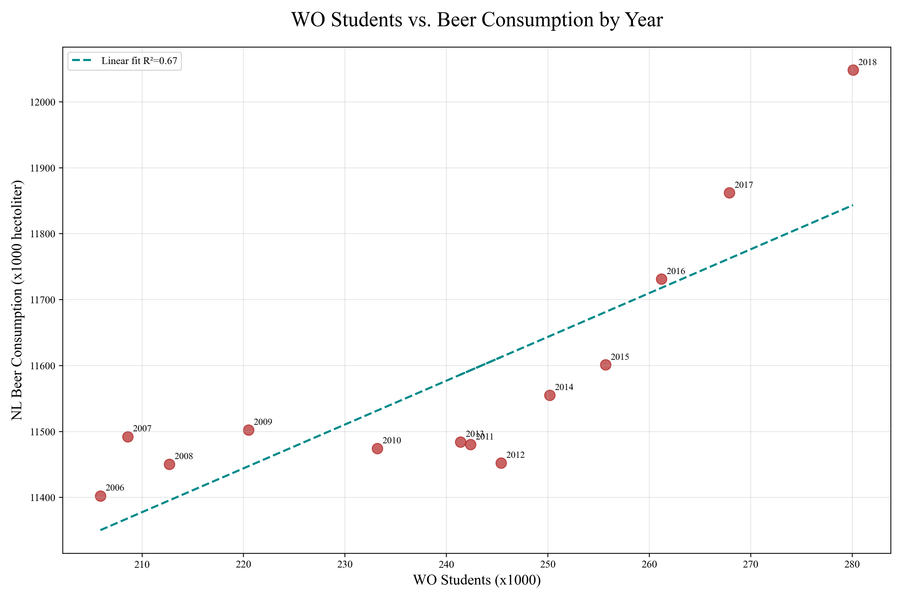

__Student_ID:__ 14627833

## Papers
__MCC Van Dyke et al., 2019:__
- Fantastic yeasts and where to find them: the hidden diversity of dimorphic fungal pathogens

__JT Harvey, Applied Ergonomics, 2002:__
- An analysis of the forces required to drag sheep over various surfaces

__DW Ziegler et al., 2005:__
- The neurocognitive effects of alcohol on adolescents and college students

## Plot

### Interpretation
The plot shows a moderate statistical correlation between the beer consumption in the Netherlands and the number of WO students ($R^2$ = 0.67). However, this correlation is likely not due to a causal relationship between the two variables, but they both simply increase over time. 
